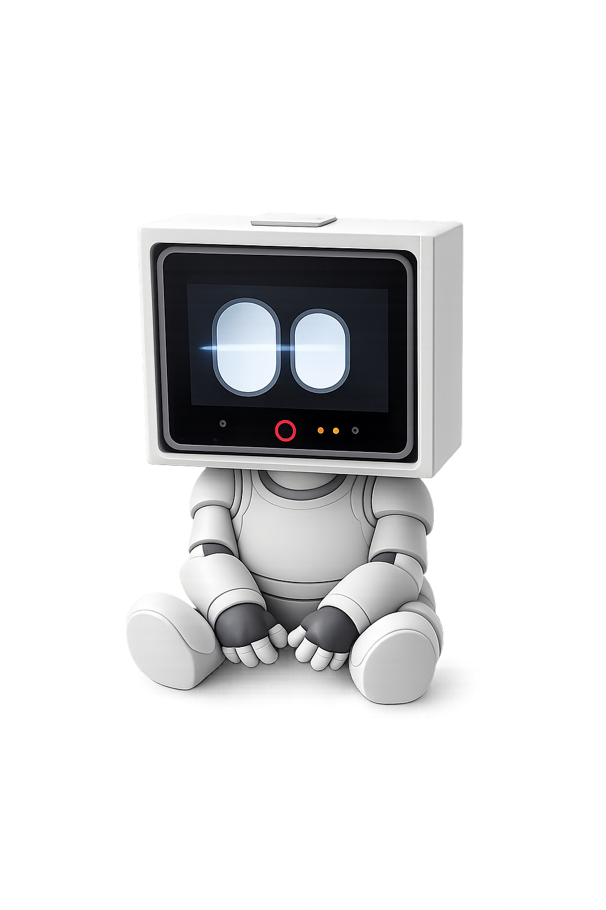
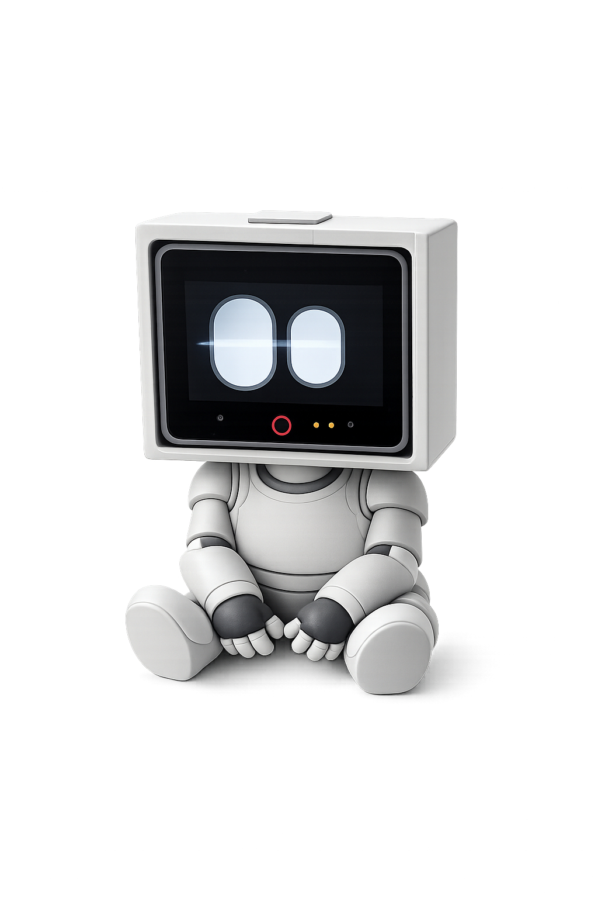
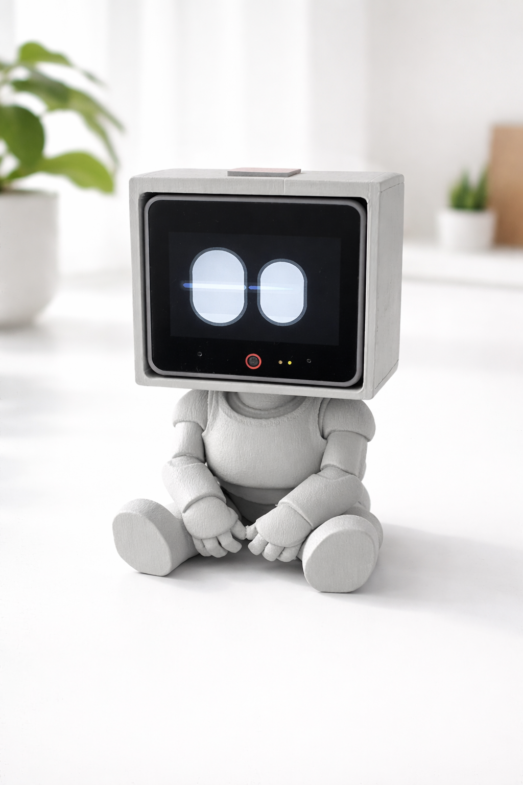



  

# BOB (Bad Or Brilliant)

> BOB (Bad Or Brilliant) turns your M5Stack CoreS3 into a living smart companion with expressive eyes, emotional behavior, on-screen messages, and instant Home Assistant control. Install via HACS in minutes and bring automations to life with personality, motion, and real-time feedback right on Bob's face. It's either bad or brilliant.
`r`n

## Highlights

- Expressive eye engine with personality-driven behavior
- On-screen text notifications
- Modes: clock/screensaver, matrix, snow, celebrate
- Home Assistant integration via HACS + MQTT
- Built-in onboarding flow with QR install path

## Gallery

## Requirements

- M5Stack CoreS3
- Home Assistant (with MQTT configured)
- HACS installed in Home Assistant

## Installation

### 1. Install Through HACS

1. Open HACS in Home Assistant.
2. Add this repository as a Custom Repository:
   - URL: `https://github.com/HomeVox/Bob`
   - Type: `Integration`
3. Install **Bob**.
4. Restart Home Assistant.
5. Add integration: `Settings -> Devices & Services -> Add Integration -> Bob`.

### 2. Flash Bob Firmware

Firmware source:

- `firmware/bob`

Upload with your preferred Arduino/PlatformIO workflow.

### 3. Configure Firmware

Use:

- `firmware/bob/config.h`
- `firmware/bob/config.example.h` (template)

Set at minimum:

- WiFi credentials
- MQTT host/user/password
- `BOB_HA_GITHUB_URL` (already set to this repo)

## Quick Start

1. Boot Bob.
2. Scan onboarding QR on Bob's screen.
3. Install the HACS integration.
4. Add Bob integration in Home Assistant.
5. Start sending text and triggering actions.

## Home Assistant Services

Domain: `bob`

- `bob.send_text`
- `bob.set_emotion`
- `bob.run_action`
- `bob.set_mode`

Service schema:

- `custom_components/bob/services.yaml`

## Supported Modes and Actions

Modes:

- `matrix`
- `snow`
- `cannons`
- `screensaver`
- `clock`
- `tracking`
- `camera_stream`
- `auto_emotion`
- `proximity`
- `auto_brightness`

Actions:

- `wake`
- `sleep`
- `blink`
- `follow`
- `curious`
- `wakeup_sequence`
- `celebrate`
- `snapshot`
- `yes`
- `no`

## Project Structure

- `custom_components/bob` - HACS integration
- `firmware/bob` - CoreS3 firmware
- `hacs.json` - HACS metadata

## License

MIT - see `LICENSE`.

